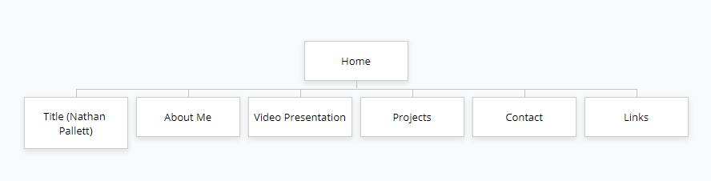
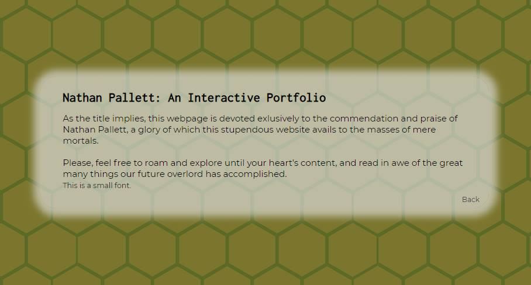
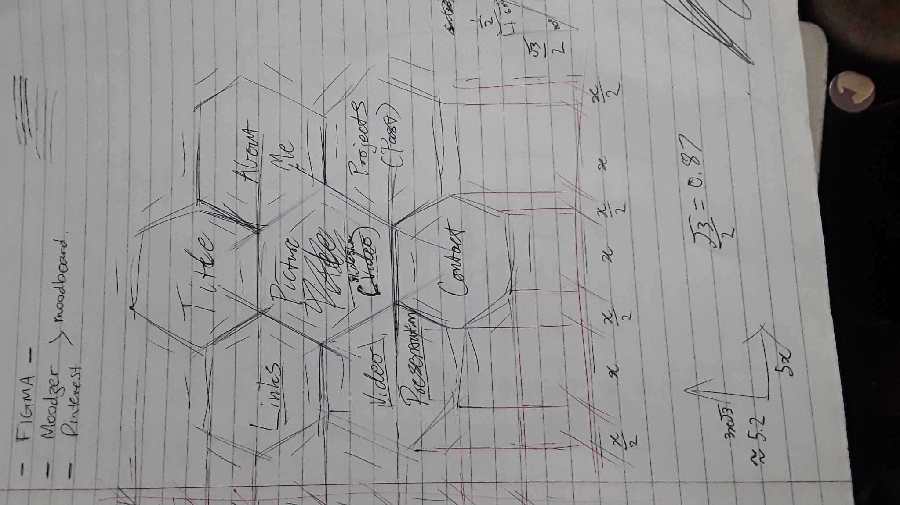
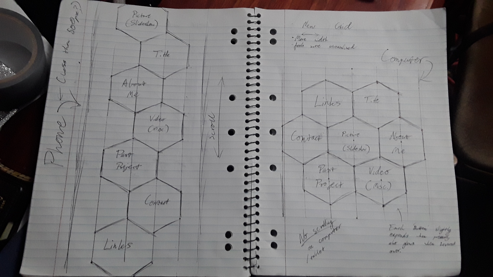
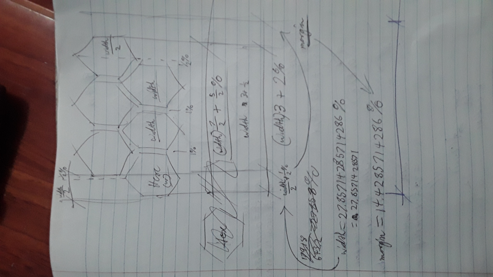
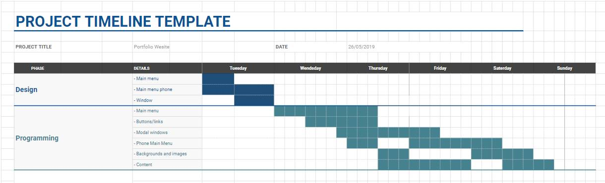

# Portfolio Website

An interactive portfolio with the purpose of detailing a my experiance and skills in web design, aswell as my personality.

## Overview

The main goal of this website was to be simple, clear, and easily accessable, whether using a computer, tablet or phone. There is little to no scrolling, information is condenced and easy to find, the layout is intuitive and comfortable.

### Features

The use of modals is the backbone if the website. The smooth transition from home page to modal window without changing webpage feels much more comfortable and reduces scrolling. Getting rid of the scroll bars all together on the homepage allows the screen to remain elegent looking while still allowing the user to view all the content, which I achieved with this.
```
html ::-webkit-scrollbar {
    width: 5px;
}
html ::-webkit-scrollbar-track {
    background: rbga(0, 0, 0, 0); 
}
html ::-webkit-scrollbar-thumb {
    background: rgba(0, 0, 0, 0.25);
    border-radius: 10px
}
html ::-webkit-scrollbar-thumb:hover {
    background: rgba(0, 0, 0, 0.5);
}
```

### Sitemap

The home page is a series of six buttons circling a picture of myself. Each button opens a modal window. They are design to be viewed clockwise starting at '12 oclock', and read "Nathan Pallett", which opens a basic description of the webpage, "About Me", a detailed summery of my education, personality, and experiance, "Video", which will eventually open a video made by myself that will function as a visual and audio medium for me to talk to the user, "Projects", a table detailing the name, a breif description, and a link to the source code of every major project i've worked on or taken a part in, "Contact", a list of my phone number, email address, and Linked-in, and "Links", a page where users can visit my github, download my CV, and eventually a whole hose of other things.



### Screenshots





### Target Audiance

Mostly employers, maybe just some peeps.

### Tech Stack

- HTML5
- CSS
- A whole lotta love ;D

## Design

I took major inspiration from the simplisity and orginisation of the hexagonal honeycomb structure. I toyed around with a basic design on pen and paper.





### Wireframe (more or less)

Seeing as I was so certain of my design and wanted to get to the dynamics as soon as possible, I decided to use my preliminary designs as basic wireframes. This ment if I liked it i could incorperate it strait into my peice.


### Usibility

A large part of my time was spent developing a second main menu to be compatible with phones, as well as making sure the model was flexible and could adjust to any size and shape.

## Timeline



# Questions / Answers

### Key events in the development of the internet

The first key development in 1982, before the internet was even introduced, was the Simple Mail Transfer Protocol, SMTP, which allowed networks of computers to recognise eachother and send / recieve data. This made the backbone of the IP address, which was cruicial in the development of an orginised world wide network. 7 years later, Tim Berners-Lee and Robert Cailliau collaborate to create a virtual system that multiple computers could read/compile/edit, creating the first 'hypertext' or markdown language and system. In 3 years time, this network would expand to 50 servers world wide. Finally in 1995, Java was introduced, allowing websites and webpages to be more accessible, easier to use, and easier to make, beging the expansion of the 'modern' internet.

### Domains, web servers, and web browsers

Navigation the internet would be imposible without Domains. These are specifications put on web pages called domain names, made up of a host name, for the purpose of finding said page. DNS, Domain Name Servers, are a compilation of domain names and there corisponding IP adress. Finding the IP adress of a domain is what allows us to access this web page, even if we've already found it. These domains however, although stored on virtual a DNS, are in reality stored on physical servers and their sorfware called 'web servers'. The purpose of web browsers in this entire mix is to allow you to find a websites domain name by entering a few key words. It does this by releaseing virtual 'spiders', programs that flick between domain and domain, recording any domains who's web pages contain any of the key words.

### Development of internet technologies

An added benifit of the development of new technologies has been the rise of networking, shared IP's, and virtual machines. The clever design of this network has inspired many people to create their own network of 'Virual' computers that function as a series of servers on a network, exchanging data, working multiple individual puposes while maintaining CP usage.